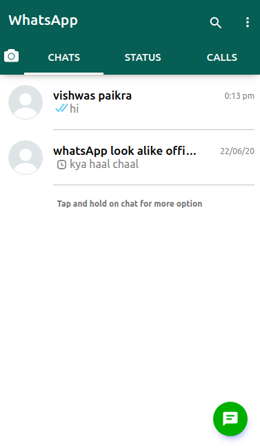

# Whatsapp-look-alike

hey I have created/creating a webApp version of whatsApp
[Know more about me](https://vishwaspaikra007.github.io/portfolio-vishwas-paikra/)  

## Now user can see msg status in chats list in chat.js

# # whatsapp-look-alike
